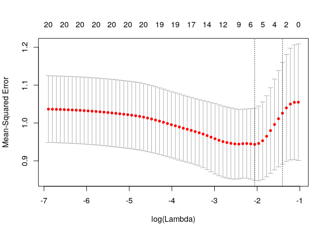
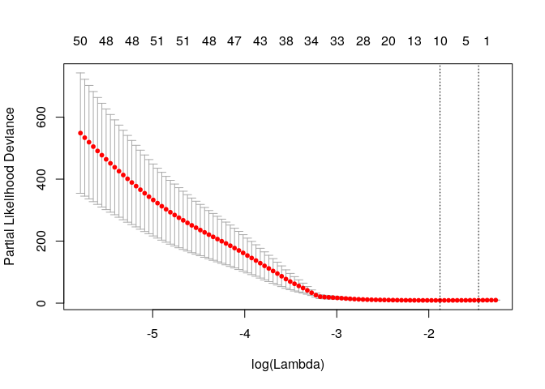
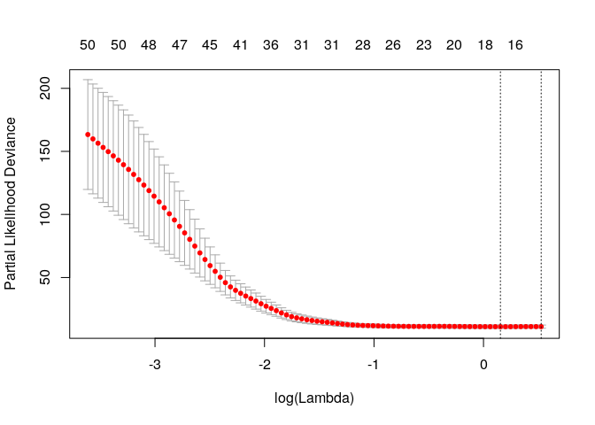
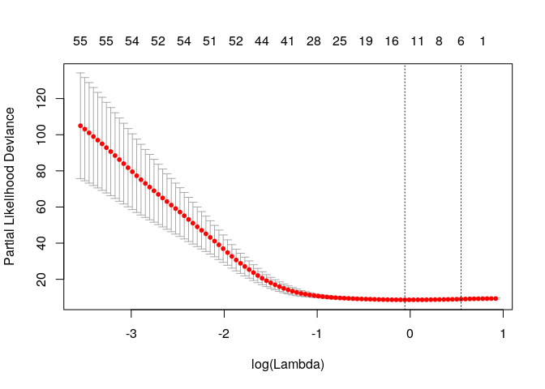
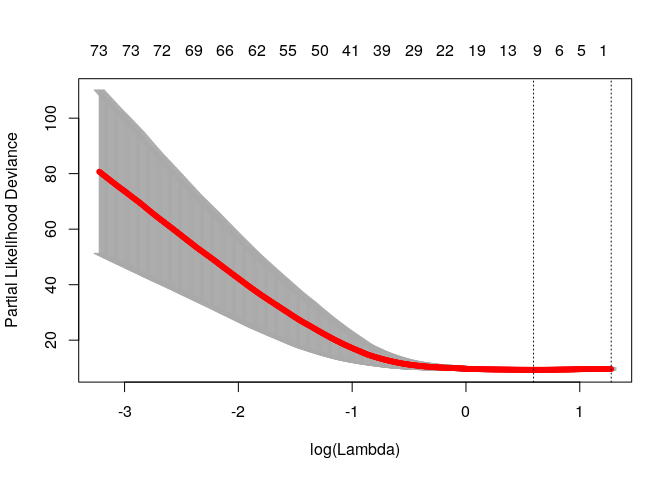

name needed
================

> Elastic-Net models with additional regularization based on network centrality metrics

-   [Install](#install)
-   [Citation](#citation)
-   [Overview](#overview)
    -   [Example for gaussian models](#example-for-gaussian-models)
    -   [Survival Example using RNASeq data](#survival-example-using-rnaseq-data)

Install
-------

Bioconductor is necessary for the installation of this package.

``` r
source("https://bioconductor.org/biocLite.R")
biocLite('averissimo/network.cox', dependencies=TRUE, build_vignettes=FALSE)
```

Citation
--------

...

Overview
--------

This package extends the `glmnet` r-package with network-based regularization based on features relations. This network can be calculated from the data itself or using external networks to enrich the model.

It adds two new main functions called `network.glmnet` and `network.cv.glmnet` that extend both model inference and model selection via cross-validation with network-based regularization.

There are 3 methods available to use data-dependant methods to generate the netork:

1.  Correlation matrix with cutoff;
2.  Covariance matrix with cutoff;
3.  Sparse bayesian networks using `sparsebn` package.

Alternatively, the network can be passed as a adjancency matrix or an already calculate metric for each node.

### Example for gaussian models

The example below, shows random datasets being generated and `network.glmnet` new function being called.

``` r
library(network.cox)
# Gaussian
x <- matrix(rnorm(100*20),100,20)
y <- rnorm(100)
fit1 <- network.glmnet(x,y, 'correlation')
plot(fit1)
```


The result can be used with all functions available to glmnet objects, such as `predict`, `coef` or plot

``` r
predicted <- predict(fit1, newx=x[1:10,],s=c(0.01,0.005))
```

    ## [INFO] Observed vs. Predicted
    ## 
    ##         Observed lambda_0.01 lambda_0.005
    ##  [1,] -0.1852567  -0.3573519   -0.3412778
    ##  [2,]  0.3061704   0.2088865    0.2304297
    ##  [3,] -0.3244506  -0.1130600   -0.1295346
    ##  [4,]  0.6764276  -0.2949259   -0.3345391
    ##  [5,] -1.1388622  -0.4007231   -0.3997077
    ##  [6,] -0.9735509   0.3234902    0.3317818
    ##  [7,]  0.7099490   0.2833419    0.3468878
    ##  [8,]  0.1905984  -0.4467155   -0.4820578
    ##  [9,] -1.7464571  -0.5601308   -0.5904652
    ## [10,]  0.4164180   0.2005956    0.2150257

It also extends the new methods to the cross validation function with `network.cv.glmnet`

``` r
plot(network.cv.glmnet(x,y, 'covariance'))
```



### Survival Example using RNASeq data

We use an example data from TCGA Adrenocortical Carcinoma project with '92' patients and a reduced RNASeq data. See `MultiAssayExperiment::miniACC` for more information on the data.

There is some pre-processing needed to remove patients with invalid follow-up date or death date:

``` r
# load data
xdata <- MultiAssayExperiment::miniACC

# build valid data with days of last follow up or to event
event.ix <- which(!is.na(xdata$days_to_death))
cens.ix  <- which(!is.na(xdata$days_to_last_followup))
surv_event_time <- array(NA, nrow(xdata@colData))
surv_event_time[event.ix] <- xdata$days_to_death[event.ix]
surv_event_time[cens.ix]  <- xdata$days_to_last_followup[cens.ix]

# Keep only valid individuals
#
# they are valid if they have:
#  - either a follow_up time or event time
#  - a valid vital_status (i.e. not missing)
#  - folloup_time or event_time > 0
valid.ix <- as.vector(!is.na(surv_event_time) & !is.na(xdata$vital_status) & surv_event_time > 0)
ydata <- data.frame(time      = surv_event_time[valid.ix], 
                    status    = xdata$vital_status[valid.ix], 
                    row.names = xdata$patientID[valid.ix])
```

Fitting the survival model using a correlation network with cutoff at 0.1, 0.4 and 0.6

``` r
# build response object for glmnet
#  we are using 
fit3 <- network.cv.glmnet(xdata, ydata, family = 'cox', 
                          network = 'correlation', 
                          experiment.name = 'RNASeq2GeneNorm', 
                          network.options = network.options.default(cutoff = .1))
plot(fit3)
```



``` r
fit4 <- network.cv.glmnet(xdata, ydata, family = 'cox', 
                          network = 'correlation', 
                          experiment.name = 'RNASeq2GeneNorm', 
                          network.options = network.options.default(cutoff = .4))
```

    ## Warning in network.glmnet.private(fun, t(assay(xdata)), ydata, network, :
    ## The penalty.factor calculated from network (or given) has some 0
    ## values, this might lead to convergence problems. Try using min.degree in
    ## network.options to tweak a minimum value.

``` r
plot(fit4)
```



``` r
# note that this should take some time and not converge
#
# A min.degree option is required for this to converge as many features have penalty = 0
#  that does not induce any regularization to it, which given the right dataset,
#  might not allow for convergence of lambda values
#
# fit5 <- network.cv.glmnet(xdata, ydata, family = 'cox', 
#                          network = 'correlation', 
#                          experiment.name = 'RNASeq2GeneNorm', 
#                          network.options = network.options.default(cutoff = .6))

fit6 <- network.cv.glmnet(xdata, ydata, family = 'cox', 
                          network = 'correlation', 
                          experiment.name = 'RNASeq2GeneNorm', 
                          network.options = network.options.default(cutoff = .6, min.degree = 0.2))
plot(fit6)
```



``` r
fit7 <- network.cv.glmnet(xdata, ydata, family = 'cox', 
                          network = 'correlation', 
                          experiment.name = 'RNASeq2GeneNorm', 
                          alpha = .7,
                          nlambda = 1000,
                          network.options = network.options.default(cutoff = .6, min.degree = 0.2))
plot(fit7)
```


