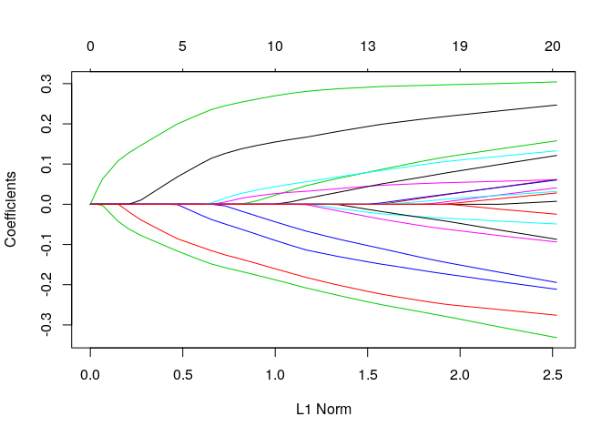
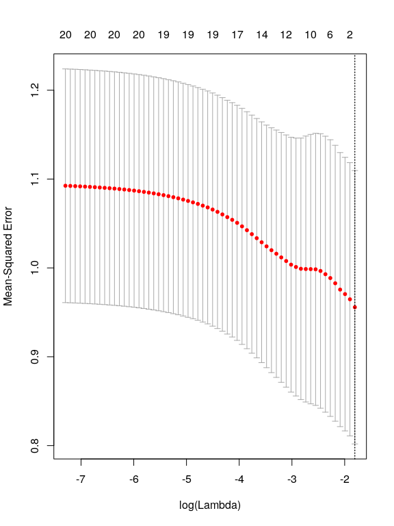
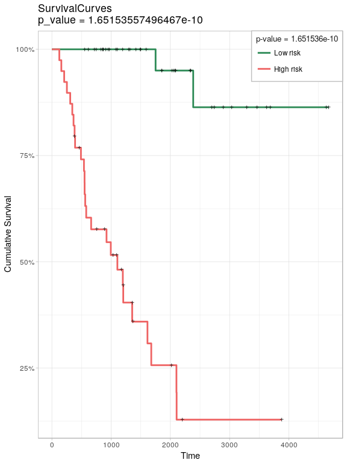

glmSparseNet
================

-   [Install](#install)
-   [Citation](#citation)
-   [Overview](#overview)
    -   [Example for Gaussian models](#example-for-gaussian-models)
    -   [Survival Example using RNASeq data](#survival-example-using-rnaseq-data)
-   [Visualization tools](#visualization-tools)
    -   [Survival curves with `draw.kaplan`](#survival-curves-with-draw.kaplan)
    -   [Heatmap with results from Hallmarks of cancer](#heatmap-with-results-from-hallmarks-of-cancer)

> Elastic-Net models with additional regularization based on network centrality metrics

Install
-------

Bioconductor is necessary for the installation of this package.

``` r
source("https://bioconductor.org/biocLite.R")
biocLite('averissimo/loose.rock')
biocLite('network.cox', siteRepos = 'https://sels.tecnico.ulisboa.pt/r-repos/')
```

Citation
--------

This package was developed by André Veríssimo, Eunice Carrasquinha, Marta B. Lopes and Susana Vinga under the project SOUND, funded from the European Union Horizon 2020 research and innovation program under grant agreement No. 633974.

A more detailed description of the method here developed, will be released soon in a paper.

Overview
--------

Next, are the libraries needed.

``` r
library(futile.logger)
library(dplyr)
library(ggplot2)
library(reshape2)
library(MultiAssayExperiment)
library(survival)
library(glmnet)
library(loose.rock)
library(network.cox)
```

This package extends the `glmnet` r-package with network-based regularization based on features relations. This network can be calculated from the data itself or using external networks to enrich the model.

It adds two new main functions called `network.glmnet` and `network.cv.glmnet` that extend both model inference and model selection via cross-validation with network-based regularization.

There are 3 methods available to use data-dependant methods to generate the netork:

1.  Correlation matrix with cutoff;
2.  Covariance matrix with cutoff; <!-- 1. Sparse bayesian networks using `sparsebn` package. -->

Alternatively, the network can be passed as an adjancency matrix or an already calculate metric for each node.

### Example for Gaussian models

The example below, shows random datasets being generated and `network.glmnet` new function being called.

``` r
# Gaussian
x <- matrix(rnorm(100*20),100,20)
y <- rnorm(100)
fit1 <- network.glmnet(x,y, 'correlation', network.options = network.options.default(cutoff = 0.1))
```

Inspecting the penalty.factor used from correlation network.

``` r
fit1$penalty.factor
```

    ##  [1] 8 6 7 9 8 8 5 9 4 3 8 6 7 6 4 3 7 6 4 4

Plot the results of the `glmnet` run.

``` r
plot(fit1)
```



The given network parameter can also be a network itself, i.e. a matrix. The example below uses a randomly generated network to use in the methods.

``` r
# generate random network
rand.network       <- abs(matrix(rnorm(20*20),20,20))
diag(rand.network) <- 0
# actual fit
fit4 <- network.glmnet(x,y, rand.network, network.options = network.options.default(cutoff = 0.1))
```

The result can be used with all functions available to glmnet objects, such as `predict`, `coef` or plot.

``` r
predicted <- predict(fit1, newx=x[1:10,],s=c(0.01,0.005))
```

    ## [INFO] Observed vs. Predicted
    ## 
    ##         Observed lambda_0.01 lambda_0.005
    ##  [1,]  0.4515920  0.63136883   0.67624347
    ##  [2,]  0.6075526 -0.10468277  -0.08421539
    ##  [3,] -0.9660819 -0.16245387  -0.17124005
    ##  [4,]  0.1472950  0.49585668   0.51727697
    ##  [5,]  1.3637081  0.74271693   0.71723106
    ##  [6,]  1.1001344  0.46825077   0.47159313
    ##  [7,]  0.4642190 -0.26287298  -0.25697347
    ##  [8,] -0.5646263 -0.32642920  -0.34920449
    ##  [9,] -0.9002533 -0.13867345  -0.16703451
    ## [10,]  1.5328196  0.03022623   0.05501400

It also extends the new methods to the cross validation function with `network.cv.glmnet`.

``` r
plot(network.cv.glmnet(x,y, 'covariance'))
```



### Survival Example using RNASeq data

We use an example data from TCGA Adrenocortical Carcinoma project with '92' patients and a reduced RNASeq data. See `MultiAssayExperiment::miniACC` for more information and details of the data.

There is some pre-processing needed to remove patients with invalid follow-up date or death date:

``` r
library(MultiAssayExperiment)
# load data
xdata <- miniACC

# build valid data with days of last follow up or to event
event.ix <- which(!is.na(xdata$days_to_death))
cens.ix  <- which(!is.na(xdata$days_to_last_followup))
surv_event_time <- array(NA, nrow(xdata@colData))
surv_event_time[event.ix] <- xdata$days_to_death[event.ix]
surv_event_time[cens.ix]  <- xdata$days_to_last_followup[cens.ix]

# Keep only valid individuals
#
# they are valid if they have:
#  - either a follow_up time or event time
#  - a valid vital_status (i.e. not missing)
#  - folloup_time or event_time > 0
valid.ix <- as.vector(!is.na(surv_event_time) & !is.na(xdata$vital_status) & surv_event_time > 0)
ydata <- data.frame(time      = surv_event_time[valid.ix], 
                    status    = xdata$vital_status[valid.ix], 
                    row.names = xdata$patientID[valid.ix])
```

Fitting the survival model using a correlation network with cutoff at 0.6.

``` r
# build response object for glmnet
fit3 <- network.cv.glmnet(xdata, ydata, family = 'cox', 
                          network = 'correlation', 
                          experiment.name = 'RNASeq2GeneNorm', 
                          alpha = .7,
                          nlambda = 1000,
                          network.options = network.options.default(cutoff = .6, 
                                                                    min.degree = 0.2,
                                                                    trans.fun = degree.heuristic))
plot(fit3)
```


Visualization tools
-------------------

### Survival curves with `draw.kaplan`

This function generates Kaplan-Meier survival model based on the coefficients of a Cox model. It separates two groups based on relative risk and display both the curves and results of Log-rank test.

``` r
xdata.reduced <- reduce.by.experiment(xdata, 'RNASeq2GeneNorm')
ydata.km <- ydata[rownames(xdata.reduced@colData),]
best.model.coef <- coef(fit3, s = 'lambda.min')[,1]
draw.kaplan(best.model.coef, t(assay(xdata[['RNASeq2GeneNorm']])), ydata.km, ylim = c(0,1))
```

    ## $pvalue
    ## [1] 3.724993e-08
    ## 
    ## $plot



    ## 
    ## $km
    ## Call: survfit(formula = survival::Surv(time, status) ~ group, data = prognostic.index.df)
    ## 
    ##            n events median 0.95LCL 0.95UCL
    ## Low risk  40      3     NA      NA      NA
    ## High risk 39     25   1105     579    2105

### Heatmap with results from Hallmarks of cancer

Search the non-zero coefficients in the results and query for known hallmarks of cancer.

``` r
hallmarks(names(best.model.coef)[best.model.coef > 0])$heatmap
```


