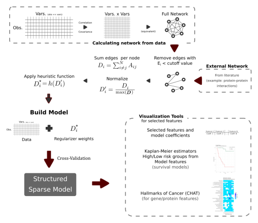
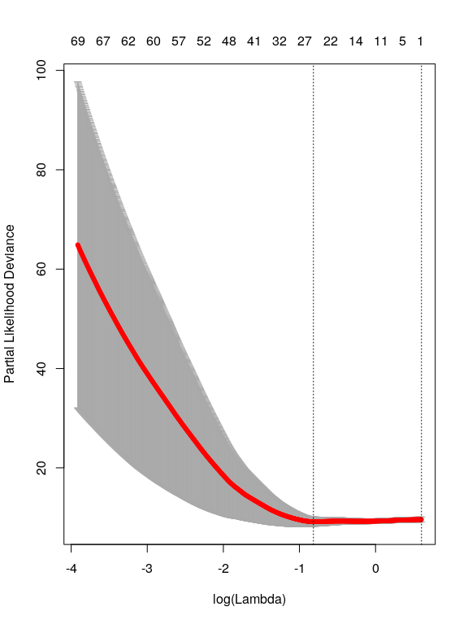
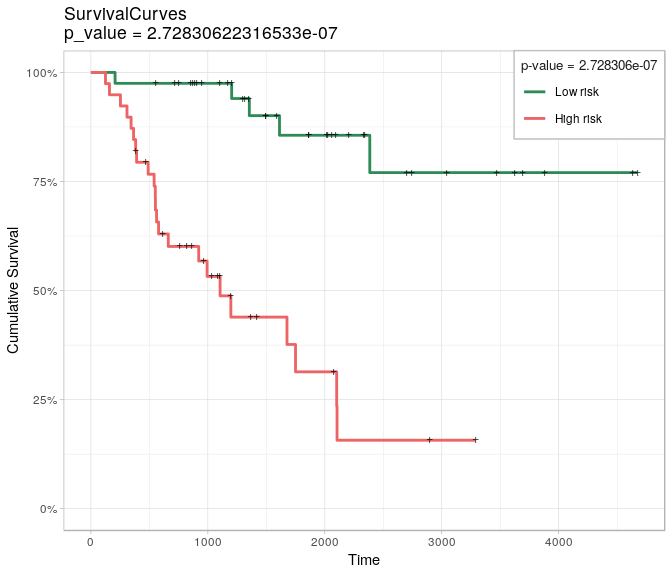
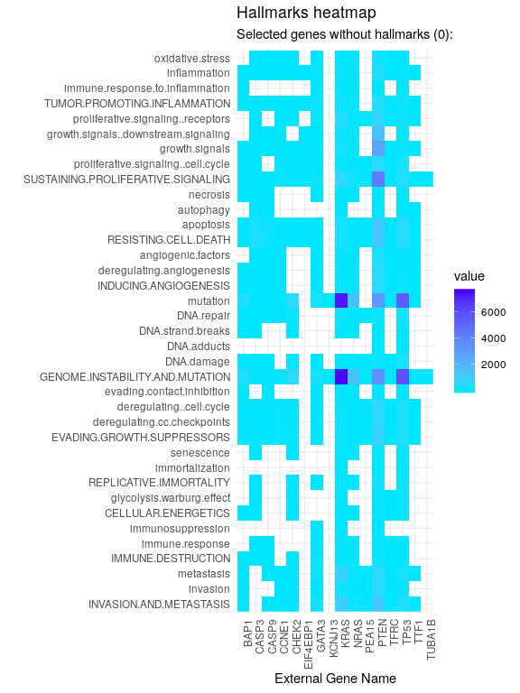

glmSparseNet
================

-   [Overview](#overview)
-   [Citation](#citation)
-   [Instalation](#instalation)
-   [Details](#details)
    -   [Function definition](#function-definition)
-   [Example for survival analysis using RNA-seq data](#example-for-survival-analysis-using-rna-seq-data)
-   [Visualization and Analytical tools](#visualization-and-analytical-tools)
    -   [Survival curves with `separate2groupsCox`](#survival-curves-with-separate2groupscox)
    -   [Heatmap with results retrived from the Cancer Hallmarks Analytics Tool *(CHAT)*](#heatmap-with-results-retrived-from-the-cancer-hallmarks-analytics-tool-chat)

<!-- README.md is generated from README.Rmd. Please edit that file -->
> Elastic-Net models with additional regularization based on network centrality metrics

[](https://travis-ci.org/sysbiomed/glmSparseNet) [](https://codecov.io/github/sysbiomed/glmSparseNet?branch=master)

Overview
--------

`glmSparseNet` is a R package that generalizes sparse regression models when the features *(e.g. genes)* have a graph structure *(e.g. protein-protein interactions)*, by including network-based regularizers. `glmSparseNet` uses the `glmnet` R-package, by including centrality measures of the network as penalty weights in the regularization. The current version implements regularization based on node degree, i.e. the strength and/or number of its associated edges, either by promoting hubs in the solution or orphan genes in the solution. All the `glmnet` distribution families are supported, namely *"gaussian"*, *"poisson"*, *"binomial"*, *"multinomial"*, *"cox"*, and *"mgaussian"*.

It adds two new main functions called `glmSparseNet` and `cv.glmSparseNet` that extend both model inference and model selection via cross-validation with network-based regularization. These functions are very flexible and allow to transform the penalty weights after the centrality metric is calculated, thus allowing to change how it affects the regularization. To facilitate users, we made available a function that will penalize low connected nodes in the network - `glmDegree` - and another that will penalize hubs - `glmOrphan`.

<span style="display:block;text-align:center"></span>

Below, we provide one example for survival analysis using transcriptomic data from the TCGA Adrenocortical Carcinoma project. More information and Rmd files are available in the vignettes folder where more extensive and complete examples are provided for logistic regresson and Cox's regression for different types of cancer data.

Citation
--------

Veríssimo, A., Oliveira, A.L., Sagot, M.-F., & Vinga, S. (2016). DegreeCox – a network-based regularization method for survival analysis. BMC Bioinformatics. 17(16): 449. <https://doi.org/10.1186/s12859-016-1310-4>

A more detailed description of the extensions here developed will be released soon in a manuscript (under preparation).

This package was developed by André Veríssimo, Eunice Carrasquinha, Marta B. Lopes and Susana Vinga under the project SOUND, funded from the European Union Horizon 2020 research and innovation program under grant agreement No. 633974.

Instalation
-----------

Bioconductor is necessary for the installation of this package.

``` r
if (!require("BiocManager"))
    install.packages("BiocManager")
BiocManager::install("glmSparseNet")
```

Details
-------

This package extends the `glmnet` r-package with network-based regularization based on features relations. This network can be calculated from the data itself or using external networks to enrich the model.

There are 3 methods available to use data-dependant methods to generate the network:

1.  Correlation matrix with cutoff;
2.  Covariance matrix with cutoff;
3.  Sparse bayesian networks using `sparsebn` package.

Alternatively, the network can be passed as an adjancency matrix or an already calculate metric for each node.

### Function definition

The main functions from this packages are the `glmSparseNet` and `cv.glmSparseNet` and the arguments for the functions are defined as:

-   `xdata`: A MultiAssayExperiment object or an input matrix of dimension `Observations x Features`
-   `ydata`: Response object that can take different forms depending on the model family that is used
-   `family`: Model type that can take: *"gaussian"*, *"poisson"*, *"binomial"*, *"multinomial"*, *"cox"*, and *"mgaussian"*
-   `network`: Network to use in penalization, it can take as input: "correlation", "covariance", "sparsebn", a matrix object with p.vars x p.vars representing the network, a weighted vector of penalties
-   `experiment.name`: Optional parameter used with a "MultiAssayExperiment" object as input
-   `network.options`: Optional parameter defining the options to process the network, such as:
-   `cutoff`: A real number to use to remove edges from the network
-   `min.degree`: Minimum value that the weight should have, this is useful as when the weight is 0, there is no regularization on that feature, which may lead to convergence problems
-   `trans.fun`: Transformation function to the vector of penalty weights after these are calculated from the network

*note:* These functions can take any additional arguments that `glmnet` or `cv.glmnet` accept (e.g. number of folds in cross validation)

``` r
cv.glmSparseNet(xdata, 
                ydata, 
                family = 'cox', 
                network = 'correlation', 
                network.options = networkOptions(cutoff = .6, 
                                                 min.degree = 0.2))
```

Example for survival analysis using RNA-seq data
------------------------------------------------

This example uses an adrenal cancer dataset using the correlation to calculate the network and cross-validation to find the optimal model. The network itself if filtered using a cutoff value of 0.6, i.e. all edges that have a correlation between the two features *(genes)* below the cutoff value are discarded.

The data was retrieved from TCGA database and the Adrenocortical Carcinoma project with 92 patients and a reduced RNASeq data. See Bioconductor package `MultiAssayExperiment` for more information on the `miniACC` dataset.

To run the following examples, the next libraries are also needed:

``` r
library(futile.logger)
library(dplyr)
library(ggplot2)
library(reshape2)
library(MultiAssayExperiment)
library(survival)
library(glmnet)
library(loose.rock)
library(glmSparseNet)
```

There is some pre-processing needed to remove patients with invalid follow-up date or death date:

``` r
# load data
xdata <- miniACC

# build valid data with days of last follow up or to event
event.ix <- which(!is.na(xdata$days_to_death))
cens.ix  <- which(!is.na(xdata$days_to_last_followup))
surv_event_time <- array(NA, nrow(xdata@colData))
surv_event_time[event.ix] <- xdata$days_to_death[event.ix]
surv_event_time[cens.ix]  <- xdata$days_to_last_followup[cens.ix]

# Keep only valid individuals
#
# they are valid if they have:
#  - either a follow_up time or event time
#  - a valid vital_status (i.e. not missing)
#  - folloup_time or event_time > 0
valid.ix <- as.vector(!is.na(surv_event_time) & !is.na(xdata$vital_status) & surv_event_time > 0)
ydata <- data.frame(time      = surv_event_time[valid.ix], 
                    status    = xdata$vital_status[valid.ix], 
                    row.names = xdata$patientID[valid.ix])
```

The function `cv.glmSparseNet` fits the survival data using 10-fold cross validation and using a cutoff value of 0.6 to reduce the size of the network.

``` r
# build response object for glmnet
fit3 <- cv.glmSparseNet(xdata, ydata, family = 'cox', 
                        network = 'correlation', 
                        experiment.name = 'RNASeq2GeneNorm', 
                        alpha = .7,
                        nlambda = 1000,
                        network.options = networkOptions(
                            cutoff = .6, 
                            min.degree = 0.2,
                            trans.fun = hubHeuristic)
                        )
plot(fit3)
```



*Cross validation plot, showing all 1000 lambdas tested and the error for each, vertical lines show best model and another with fewer variables selected within one standard error of the best.*

Visualization and Analytical tools
----------------------------------

### Survival curves with `separate2groupsCox`

This function generates Kaplan-Meier survival model based on the estimated coefficients of the Cox model. It creates two groups based on the relative risk and displays both survival curves *(high vs. low-risk patients, as defined by the median)* and the corresponding results of log-rank tests.

``` r
# Data to use in draw.kaplan function
#  * it takes the input data, response and coefficients
#  * calculates the relative risk
#  * separates individuals based on relative risk into High/Low risk groups
xdata.reduced   <- reduceByExperiment(xdata, 'RNASeq2GeneNorm')
ydata.km        <- ydata[rownames(xdata.reduced@colData),]
best.model.coef <- coef(fit3, s = 'lambda.min')[,1]
```

Kaplan-Meier plot

``` r
separate2GroupsCox(best.model.coef, t(assay(xdata[['RNASeq2GeneNorm']])), ydata.km, ylim = c(0,1))
```

    ## $pvalue
    ## [1] 3.878366e-07
    ## 
    ## $plot



    ## 
    ## $km
    ## Call: survfit(formula = survival::Surv(time, status) ~ group, data = prognostic.index.df)
    ## 
    ##            n events median 0.95LCL 0.95UCL
    ## Low risk  40      5     NA      NA      NA
    ## High risk 39     23   1105     579      NA

### Heatmap with results retrived from the Cancer Hallmarks Analytics Tool *(CHAT)*

Search the non-zero coefficients, i.e., the selected features/genes, and query CHAT for known hallmarks of cancer. Also plots the genes not found, useful for new hypotheses generation.s

``` r
hallmarks(names(best.model.coef)[best.model.coef > 0])$heatmap
```


