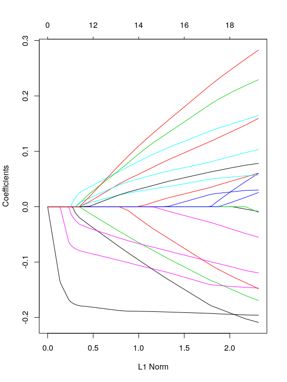

name needed!!
================

-   [Install](#install)
-   [Citation](#citation)
-   [Overview](#overview)
    -   [Example for gaussian models](#example-for-gaussian-models)
    -   [Survival Example using RNASeq data](#survival-example-using-rnaseq-data)
-   [Visualization tools](#visualization-tools)
    -   [Survival curves with `draw.kaplan`](#survival-curves-with-draw.kaplan)
    -   [Heatmap with results from Hallmarks of cancer](#heatmap-with-results-from-hallmarks-of-cancer)

> Elastic-Net models with additional regularization based on network centrality metrics

Install
-------

Bioconductor is necessary for the installation of this package.

``` r
source("https://bioconductor.org/biocLite.R")
biocLite('averissimo/network.cox', dependencies=TRUE, build_vignettes=FALSE)
library(network.cox)
```

Citation
--------

...

Overview
--------

This package extends the `glmnet` r-package with network-based regularization based on features relations. This network can be calculated from the data itself or using external networks to enrich the model.

It adds two new main functions called `network.glmnet` and `network.cv.glmnet` that extend both model inference and model selection via cross-validation with network-based regularization.

There are 3 methods available to use data-dependant methods to generate the netork:

1.  Correlation matrix with cutoff;
2.  Covariance matrix with cutoff; <!-- 1. Sparse bayesian networks using `sparsebn` package. -->

Alternatively, the network can be passed as a adjancency matrix or an already calculate metric for each node.

### Example for gaussian models

The example below, shows random datasets being generated and `network.glmnet` new function being called.

``` r
# Gaussian
x <- matrix(rnorm(100*20),100,20)
y <- rnorm(100)
fit1 <- network.glmnet(x,y, 'correlation')
```

Inspecting the penalty.factor used from correlation network

``` r
fit1$penalty.factor
```

    ##  [1] 19 19 19 19 19 19 19 19 19 19 19 19 19 19 19 19 19 19 19 19

Plot the results of the `glmnet` run

``` r
plot(fit1)
```



The result can be used with all functions available to glmnet objects, such as `predict`, `coef` or plot

``` r
predicted <- predict(fit1, newx=x[1:10,],s=c(0.01,0.005))
```

    ## [INFO] Observed vs. Predicted
    ## 
    ##         Observed lambda_0.01 lambda_0.005
    ##  [1,]  1.0483587  0.18737087  0.217795644
    ##  [2,]  1.2516244 -0.62249673 -0.643290966
    ##  [3,] -0.7662786 -0.12135358 -0.138014688
    ##  [4,] -1.0110564 -0.37320680 -0.383441033
    ##  [5,] -0.7024665 -0.65801263 -0.666043114
    ##  [6,]  1.6890610  0.78766494  0.805749154
    ##  [7,]  1.9270533  0.15822770  0.204123349
    ##  [8,] -1.7508299  0.02048073 -0.003813778
    ##  [9,] -0.5671094 -0.06959119 -0.057959306
    ## [10,] -0.7078289 -0.01275505 -0.002229836

It also extends the new methods to the cross validation function with `network.cv.glmnet`

``` r
plot(network.cv.glmnet(x,y, 'covariance'))
```


### Survival Example using RNASeq data

We use an example data from TCGA Adrenocortical Carcinoma project with '92' patients and a reduced RNASeq data. See `MultiAssayExperiment::miniACC` for more information on the data.

There is some pre-processing needed to remove patients with invalid follow-up date or death date:

``` r
# load data
xdata <- MultiAssayExperiment::miniACC

# build valid data with days of last follow up or to event
event.ix <- which(!is.na(xdata$days_to_death))
cens.ix  <- which(!is.na(xdata$days_to_last_followup))
surv_event_time <- array(NA, nrow(xdata@colData))
surv_event_time[event.ix] <- xdata$days_to_death[event.ix]
surv_event_time[cens.ix]  <- xdata$days_to_last_followup[cens.ix]

# Keep only valid individuals
#
# they are valid if they have:
#  - either a follow_up time or event time
#  - a valid vital_status (i.e. not missing)
#  - folloup_time or event_time > 0
valid.ix <- as.vector(!is.na(surv_event_time) & !is.na(xdata$vital_status) & surv_event_time > 0)
ydata <- data.frame(time      = surv_event_time[valid.ix], 
                    status    = xdata$vital_status[valid.ix], 
                    row.names = xdata$patientID[valid.ix])
```

Fitting the survival model using a correlation network with cutoff at 0.6

``` r
# build response object for glmnet
fit3 <- network.cv.glmnet(xdata, ydata, family = 'cox', 
                          network = 'correlation', 
                          experiment.name = 'RNASeq2GeneNorm', 
                          alpha = .7,
                          nlambda = 1000,
                          network.options = network.options.default(cutoff = .6, min.degree = 0.2))
plot(fit3)
```


Visualization tools
-------------------

### Survival curves with `draw.kaplan`

This generates Kaplan-Meier survival model based on the coefficients of a Cox model. It separates two groups based on relative risk and display both the curves and results of Log-rank test.

``` r
xdata.reduced <- filter.by.experiment(xdata, 'RNASeq2GeneNorm')
ydata.km <- ydata[rownames(xdata.reduced@colData),]
best.model.coef <- coef(fit3, s = 'lambda.min')[,1]
draw.kaplan(best.model.coef, t(assay(xdata[['RNASeq2GeneNorm']])), ydata.km)
```

    ## $pvalue
    ## [1] 2.334101e-09
    ## 
    ## $plot


    ## 
    ## $km
    ## Call: survfit(formula = survival::Surv(time, status) ~ group, data = prognostic.index.df)
    ## 
    ##            n events median 0.95LCL 0.95UCL
    ## Low risk  40      2     NA      NA      NA
    ## High risk 39     26   1105     579    2102

### Heatmap with results from Hallmarks of cancer

Search the non-zero coefficients in the results and query for known hallmarks of cancer.

``` r
fit3.hallmarks <- hallmarks(names(best.model.coef)[best.model.coef > 0])

melt(fit3.hallmarks$hallmarks, id.vars = 'gene.name') %>%
  filter(value > 0) %>%
  ggplot() + 
    geom_raster(aes(gene.name, variable, fill=value)) +
    theme(axis.text.x = element_text(angle = 90, hjust = 1))
```


